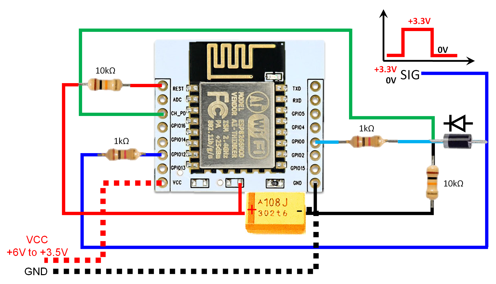

# ESP_External_Interrupt
Code to wake up ESP8266 using external interrupt and send a MQTT message and turn itself off after external signal has vanished.

Build

Source: http://www.esp8266.com/viewtopic.php?f=11&t=4458
